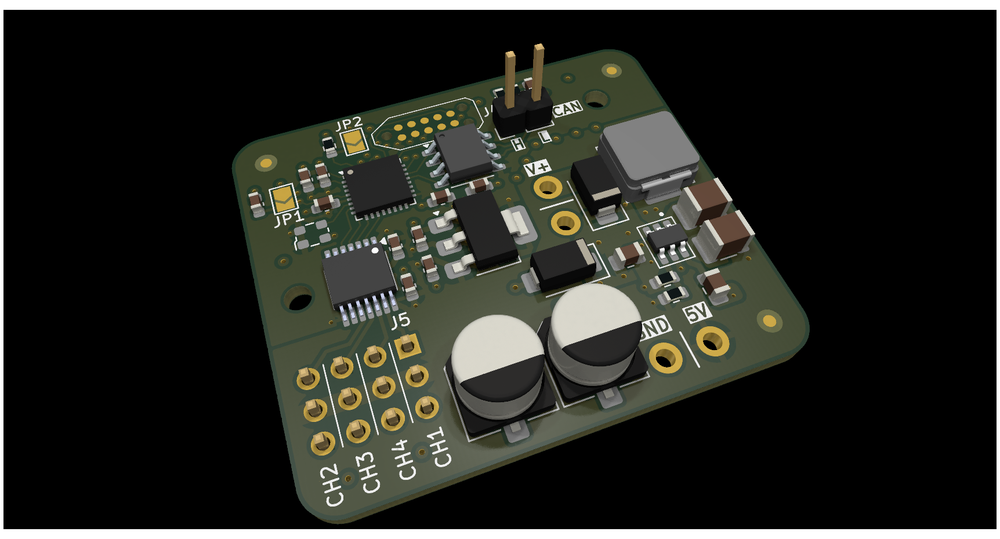
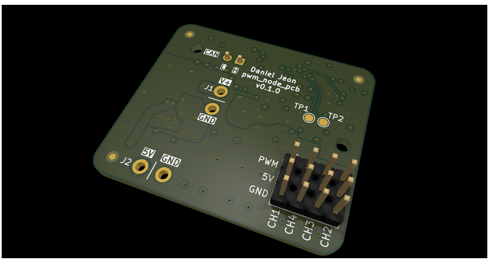

# pwm_node_pcb

PWM node production board for complete application integration.

---

  
Table of Contents

<!-- TOC -->
* [pwm_node_pcb](#pwm_node_pcb)
  * [1 Overview](#1-overview)
<!-- TOC -->

---

## 1 Overview

|                        Top                         |                          Bottom                          |
|:--------------------------------------------------:|:--------------------------------------------------------:|
|  |  |

---
